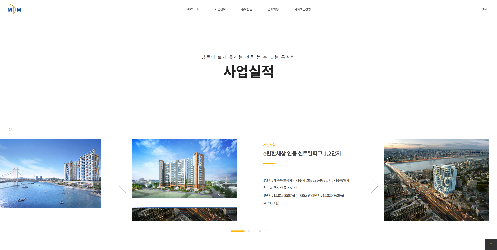
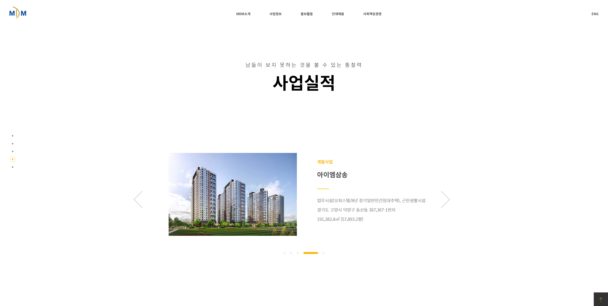

## 개요 📃

> **해당 웹사이트는 1920px 해상도를 기준으로 만들었습니다 (PC ver)**

1.  fullpage.js를 학습 후 해당 플러그인을 사용할 수 있는 웹사이트를 클론코딩.
2.  다양한 컴포넌트의 HTML과 CSS를 학습하기 위함.
3.  제이쿼리 복습을 위해 작업

## 사용기술 🤗

- 퍼블리싱

  - HTML
  - CSS
  - JQuery

- 플러그인
  - Fullpage.js
  - Swiper.js

## 기간 📅

> 2021.10.29 - 2021.11.03 (실 작업일 : 3일)

## 구현한 기능 🔧

- 2 depth navigation bar
- 다양한 hover effect
- fullpage.js와 swiper.js의 CSS 커스텀 작업 (pagination, arrow)

## 기존 웹사이트와 다르게 한 부분 🧪

#### 1. 슬라이드 부분

- 해당 슬라이드를 구현하기 위해서는 같은 컨텐츠를 HTML에 두번 넣어서 겹치는 상태로 두 효과를 구현할 수 있었다.
- 변경한 방식: 논리적인 HTML 파일을 작성하기 위해서는 같은 내용을 두번 작성하는 것은 옳지 않다고 판단하였으며 파일을 겹치면서 발생하는 이미지 겹침현상이 좋아보이지 않았기 때문에 한 effect만 구현하게 되었다.

**기존 웹사이트**

**내가 구현한 웹사이트**

---

#### 2. footer 부분

- 기존 웹사이트는 마지막 컨텐츠에서 스크롤을 내리면 footer가 겹친 형태로 위로 올라오는 방식이다.
- 해당 방식은 구현해내지 못했다. 그 이유는 fullpage.js를 쓰다보니 fixed를 활용해서 스크롤 애니메이션을 구현할 수 없었기 때문이다.
- 기존 클론코딩의 목적은 fullpage.js를 사용하기 위함이었기 때문에 푸터는 스크롤시 하단에 보이는 방식으로 진행하였다.

**기존 웹사이트**

**내가 구현한 웹사이트**

---

#### 3. Fullpage의 section별 pagination

- 몇 개의 section의 경우 배경이 하얗기 때문에 pagination이 안보이는 경우가 생겼고, 기존의 웹사이트는 그대로 흰색을 사용하였지만 UX가 좋지 않아 해당 section에서만 어두운색으로 변경되도록 하였다.

## 실행화면 🌟

## 느낀점 😌

- 처음에는 단순히 플러그인을 잘 활용하기 위해 시작한 프로젝트였지만, 다양한 CSS 효과도 공부할 수 있었다.
- 풀페이지의 슬라이드는 다양한 효과가 없어서 swiper 플러그인을 처음 사용해 보았는데 해당 프로젝트를 통해 기본 사용방식을 공부할 수 있었다.
- 플러그인의 CSS를 커스텀화 하는 방법을 공부할 수 있었다.
- 아쉬운 점이 있다면, 플러그인 활용을 목적으로 웹사이트를 만들다보니 PC버전만 염두해 두었고, 나중에서야 media query를 적용하려고 하니 웹사이트의 컴포넌트가 많이 뒤틀려 결국 적용하지 못했다. 모든 웹사이트를 만들 때는 반응형 웹으로 만들겠다는 생각으로 코드를 짜는 습관을 들이는게 좋을거 같다.
