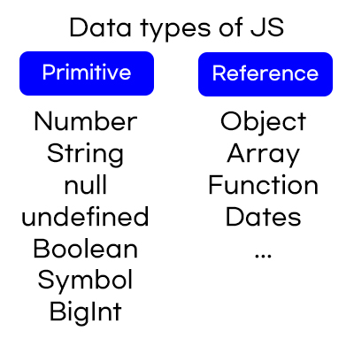

# Data types (데이터타입)

- Updates
  - [2020.08.16] - 데이터타입 중 숫자, 문자열 기본 개념 정리
  - [2020.08.24] - 숫자, 문자열 method정리 및 추가 정리
  - [2020.08.30] - primitive와 object의 차이,wrapper object, auto boxing
  - [2020.08.31] - null, undefined, boolean 추가

---

## 💡 JavaScript Data Type



- Difference between primitive and reference type:  
   How they are stored and used in memory (call stack and memory heap)  
   Call stack is the place where the code execution has been tracked. Every data in the call stack will be pointed to the memory heap.
  Memory heap is the place where the memory is allocated for variables and functions etc.
  [자세한내용 바로가기](9.Call-stack-and-Memory-heap.md)  


What is wrapper object?

- String, Number, Boolean과 같은 원시타입을 `new`키워드로 생성하면 원시타입에 대한 `wrapper object`가 생성된다.

  ```javascript
  const name = new String('kim');
  type of name;
  // object string()함수에 new를 붙이면 object가 됨.
  ```

  Auto Boxing

- 특정한 원시타입에서 property 혹은 method를 호출하려고 할 때 자바스크립트는 이를 임시 래퍼 오브젝트로 바꾼뒤 property와 method에 접근한다.
- 원본에는 아무런 영향을 주지 않는다.

  ```javascript
  const name = "kim";
  name.length;
  // auto boxing 후 임시 래퍼 오브젝트로 변환 => 3
  // 그러나 name은 그대로 문자열이다.
  ```

## Numbers (숫자)

Types of Numbers

- Integers
- Floating point numbers
- Doubles

Number wrapper object 모음
[바로가기](4a.Number-method.md)

## Strings (문자열)

Example of strings

```javascript
'hi' "hi" `hi`
```

They do not use two diffrerent quotes on the same string - **an error**

```javascript
let badQuotes = 'do not use two different quotes";
// just use '' or "" or ``
```

Escaping characters in a string

- 사용하지 않은 다른 종류의 따옴표를 사용한다.

  ```javascript
  "Hi my name is 'Kim'"

  // in internet
  Hi my name is 'Kim'
  ```

- use backslash
  ```javascript
  'Hi i\'m Kim';

  ```

Template literals

- 백틱의 특별함 : \$() - placeholder을 통해 변수를 넣을 수 있다.
  ```javascript
  const defaultResult = 0;
  let currentResult = `(${defaultResult}+10)*3/2-1`;
  ```
- `n\` newline character - if you want to split a traditional string over multiple lines.

Concatenating strings

- it means 'join together'
- in Javascript, plus operator is used for joining strings.
  ```javascript
  const one = "hello,";
  const two = "how are you?";
  let concatenate = one + two;
  console.log(concatenate);
  ```
  two strings will be joined and you can see a sentence hello, how are you? in a console.
- it can be joined as many times as possible
- it can mix variables and actual strings.

Concatenating numbers and strings

- when you add a number and string, the browser cleverly converts the number to a string and concatenates the two strings.

String wrapper object 모음
[바로가기](4a.String-wrapper-object.md)

## Null & Undefined

**Null** - explicitly give no value.

- when you add with other number, it becomes `0`

**Undefined** - not given a value yet.

- when you add with another number, it doesn't have value so it gets `NaN`

## Boolean

Boolean - True / False

Returning boolean value

- includes() method
- comparison operator
  - lowercase > uppercase
  - alphabetical order

## Type conversion

Number - `Number()`  
String - `String()`  
Boolean - `Boolean()`

Boolean은 falsy와 truthy값을 반환한다.

Falsy - `' '` / `0` / `null` / `undefined` / `false`

Truthy - Falsy 외에 모든 것.
