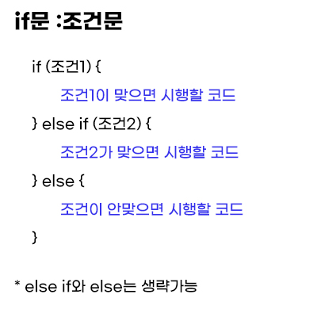
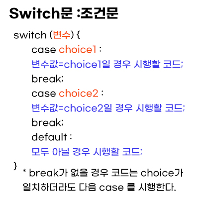

# Condition 조건문

- Updates
  - [2020.08.25] - 조건문 기본 개념 공부 및 정리
  - [2020.08.31] - 조건문 기본 개념 문법 이미지 추가
  - [2020.10.08] - short-circuit evaluation, truthy and falsy

---

## If Statements



- else는 선택 사항이다.
- 또 다른 조건이 있을 시 — using `else if`.
- else if로 여러 조건을 추가 할 수 있다.

## Non-Boolean Data Types

- 조건문은 truthy와 falsy인지 검사해야한다.
- falsy : `0`, `""`, `null`, `undefined`, `NaN`

## Using Logical Operator - short-circuit evaulation

```javascript
let defaultName;

if (username) {
  defaultName = username;
} else {
  defaultName = "guest";
}

// this is same as above
let defaultName = username || "guest";
```

## Switch Statements



- number of choices to match the value
- case 1과 case2가 같은 답변이 나온다면

  ```javascript
  case 1:
  case 2:
  원하는 것을 적으면 된다.
  ```

## Ternary Operator

```javascript
//기본 문법 조건? 참일시 코드실행: 아닐시 코드실행

( condition ) ? run this code : run this code instead
```
