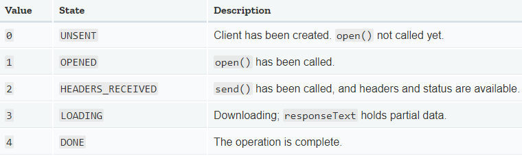

# AJAX

- Updates
  - [2020.09.25] - AJAX, XMLHttpRequest API, JSON, Callback Hell, promise, fetch API

---

## AJAX

- Asynchronous JavaScript and XML
- use of the XMLHTTPRequest object to communicate with servers.
- send and receive information in various formats, including JSON, XML, HTML, and text files.
- asynchronous nature - it communicates with the server, exchange data, and update the page without having to refresh the page

- 예전에는 XMLHttpRequest API를 이용하여 구현하였지만, 제이쿼리를 넘어서 ES6표준으로 fetch API가 등장하면서 이를 통해 구현하는 것이 일방적이다.

## XMLHttpRequest API

```jsx
var xhr = new XMLHttpRequest(); // (1)
xhr.onreadystatechange = function () {
  // (2)
  if (xhr.readyState === xhr.DONE) {
    // (2-1)
    if (xhr.status === 200 || xhr.status === 201) {
      //(2-2)
      console.log(xhr.responseText);
    } else {
      console.error(xhr.responseText);
    }
  }
};
xhr.open("GET", "https://www.zzzz.com/api/get"); // (3)
xhr.send(); // (3)
```

(1) Making a HTTP request object to request server with JavaScript

(2) Making a callback function to handle the response with `onreadystatechange` property(need to know when to process response using this property

```jsx
httpRequest.onreadystatechange = function () {
  // Process the server response here.
};
```

(2-1) in the callback function, it needs to check state of the request using `readystate` property - 요청이 끝나 응답이 준비가 되었을 때 콜백함수가 호출이 되어야하기 때문에.

**XMLHttpRequest.readyState**



(2-2)After we know that the operation is complete(request.readyState===4), we also have to check whether the HTTP request has been successfully completed.

**HTTP response status codes**

1. Informational responses (`100`–`199`),
2. Successful responses (`200`–`299`),
3. Redirects (`300`–`399`),
4. Client errors (`400`–`499`),
5. and Server errors (`500`–`599`).

After checking the state, you can do whatever you want with the data the server sen

- `httpRequest.responseText` – returns the server response as a string of text
- `httpRequest.responseXML` – returns the response as an `XMLDocument` object you can traverse with JavaScript DOM functions

(3) Make the request by using the method called open() and send()

open(method, URL)

send()

## JSON

- JavaScript Object Notation
- It is **string** that formatted like an array with lots of objects(key-value pairs) in JavaScript. but it is just a string.
- when a browser exchanges the data with server, it has to be done in text format which transfer data
- 네트워크를 통해 데이터를 주고받는 데 자주 사용되는 경량의 데이터 형식.
- `JASON.parse()` - parsing JASON string into javascript object.

format

```jason
[
  {"author": "kim", "points" : 50},
  {"author": "park", "points" : 40},
  {"author": "lee", "points" : 30}
]
```

- string은 무조건 쌍따옴표를 사용한다.

## Callback Hell

- nesting callback
- 함수의 매개변수인 콜백함수가 반복되어 감당하기 힘들 정도로 깊어지는 현상.
- 가독성이 안좋고, 디버깅, 유지보수가 어렵다.

```javascript
step1(function (value1) {
  step2(function (value2) {
    step3(function (value3) {
      step4(function (value4) {
        step5(function (value5) {
          step6(function (value6) {
            // Do something with value6...
          });
        });
      });
    });
  });
});
```

## Promise Basics

- Alternative way to use callback function
  format

```javascript
const getSomething = () => {
  return new Promise((resolved, reject) => {
    //fetch something
    resolve("this is resolved");
    //reject('some error');
  });
};

getSomething(URL)
  .then((data) => {
    console.log(data);
  })
  .catch((err) => {
    console.log(err);
  });
```

- There are two parameters in promise: resolved and reject
- two possible outcomes: resolved, rejected
- resolved promise : get callback function in `then` method
- reject promise : get callback function in `catch` method

chanining promises

- we can perform asynchronous task after one another in order
- 가독성이 좋다.

```javascript
getTodos("todo/one.json")
  .then((data) => {
    console.log("promise resolved", data);
    return getTodos("todo/two.json");
  })
  .then((data) => {
    console.log("promise2 resolved", data);
  })
  .catch((err) => {
    console.log("promise rejected", err);
  });
```

- return을 통해 새로운 제이슨을 체이닝할 수 있고(순서대로), then method를 사용해서
  응답을 받을 수 있다.

## The Fetch API

- modern edition

`fetch('URL');` - 패칭할 때 사용, `then` `catch`메소드와 같이 쓰임  
`response.json()` - json.parse()와 비슷한 것. 그러나 promise를 반환해서 변수에 담을 수 없음

```javascript
fetch("URL")
  .then((response) => {
    console.log("resolved", response);
    return response.json();
  })
  .then((data) => {
    console.log(data);
  })
  .catch((err) => {
    console.log("rejected", err);
  });
```

- promise only rejected in a network reason(error) only. URL이 잘못들어가도 resolved로 된다. 그러나 status에 404가 뜸.
- response.json()을 통해 promise를 반환하여 데이터에 접근할 수 있다.

## Async and Await

- chain promises together
- `async` function
- `await` keyword to chain

```javascript
const getTodos = async() => {

  const response = await fetch('URL');
  const data = await response.json();
  return data;
}

getTodos()
  .then(data => console.log('resolved', data);
```

- whenever we call async function, it returns promise
- async is non-blocking
- await를 사용하면 fetch가 promise가 resolved를 받을 때 까지 변수에 담는걸 기다린 후, 그 이후에 resolved가 되면 변수에 담아준다.
- async function은 promise를 반환하기 때문에 function을 호출할 때 마지막에 `then`메소드로 resolved된 데이터를 받을 수 있다.
- IE support X

## Throwing

```javascript
const getTodos = async() => {

  const response = await fetch('URL');
  if(response.status !== 200){
    throw new Error('cannot fetch the data');
  }
  const data = await response.json();
  return data;
}

getTodos()
  .then(data => console.log('resolved', data);
  .catch(err => console.log('error', err.message));

```

`.message` - resource 가 문제면 에러 메시지를 보내준다. 근데 URL이 잘못되어도 JSON에 문제가 있다고 나온다. 그 이유는 URL이 잘못되면서 그거를 파싱하는 과정에서 제이슨에 문제가 있다고 판단하기 때문(사실상 파일의 경로가 잘못되었지만). 그래서 에러메시지를 받기전에 status가 200인지부터 확인하고 아니라면 async function에서 에러를 먼저 걸러내야한다.

`throw` - throw new Error() object which helps to know that status is problem not the JSON itself.
