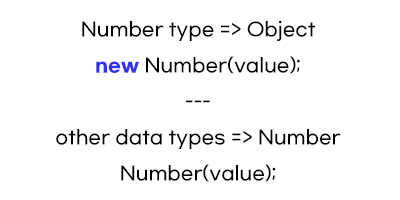

# Number Wrapper Object

- Updates
  - [2020.08.30] - Number Method 데이터 타입에서 분리 후 정리

---



### 1. Constructor
- Number() - converting to number data types

```javascript
let myNumber = "123";
Number(myNumber); // 123출력
```

### 2. Number Methods 모음

- toFixed() - round number to a fixed number of decimal places

```javascript
let myFloat = 6.12845;
let twoDecimalPlaces = myFloat.toFixed(2);
twoDecimalPlaces; 
```
 '6.13' 반올림해서 2자리수로 ★ 중요한 것은 STRING으로 변환해줌 -wrapper object ★

- parseInt() - from string to integers
- parseFloat() - from string to floating point numbers