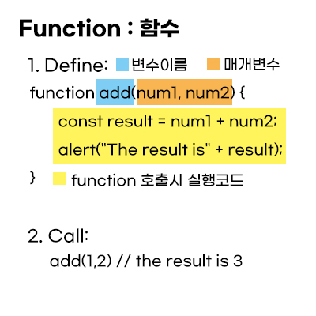
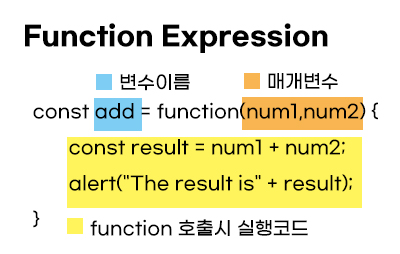
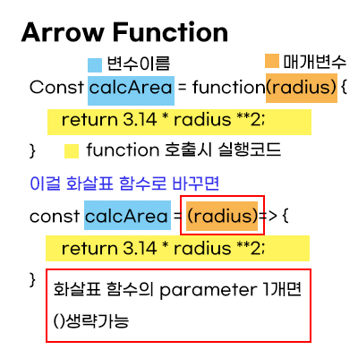

# Functions (함수)

- Updates

  - [2020.08.18] - function definition, code styles, return value, accessing a function, 함수 추가 정리, 함수 이름 짓기
  - [2020.08.19] - function 기존에 정리한 노트에 추가로 공부한 것을 적었다.
  - [2020.08.30] - 추가로 공부하면서 이해가 안갔던 부분 다시 정리

---

## Definition

Designed to perform a particular task.

- the code can be reused (use multiple time)
- building block (구성요소)
- function declaration can be hoisted but not the function expression

## Functions vocab in Korean

- Functions - 함수
- Parameters - 매개변수 : 임의의 데이터 / 매개변수의 기본값 undefined
- Argument - 인수
- Local variable - 지역변수 : 함수 내에서 선언한 변수
- Global variable - 전역변수 : 함수 외부에서 선언한 변수

## Function Declaration (함수 선언식)



1. Define Function - can use parameters(input to the function) and also return values
2. Call Function - more flexible. Allows interaction to the website. it doesn't execute directly. -> when an event occurs, called from JS code, or automatically.

```javascript
function add(num1, num2) {
  const result = num1 + num2;
  alert("The result is" + result);
}

add(1, 2);
```

Function 뜯어보기 : Example 참고

1. function = keyword
2. add = name
3. num1, num2 = parameters(optional) => to use inside the function body
4. {} = function body
5. name(parameter); = function호출

Parameters vs Arguments

- Function **parameters** : listed inside the parentheses() in the function definition
- Function **arguments** : the **values** received by the function when it is invoked

Accessing a function without ()

```javascript
function toCelsius(fahrenheit) {
  return (5/9) * (fahrenheit-32);
}
document.getElementById("demo").innerHTML = toCelsius; // do not have ()

//this will return the function object instead of the function result.
function toCelsius(fahrenheit) { return (5/9) * (fahrenheit-32);

```

## Returning Values

- Return statement ends the function execution which means the code after the return statement will not be executed.

  ```javascript
  function add(num1, num2) {
    const result = num1 + num2; // 내부 변수
    return result;
  }
  ```

## Function Expression (함수 표현식)



함수 선언식 vs 함수 표현식

- 함수 선언식(declaration)은 호이스팅 영향을 받지만 함수 표현식(expression)은 받지 않는다.

## Arrow Function (화살표 함수)



- arrow function같은 경우 return이 하나면 reuturn구문과 {}도 생략이 가능하다.

  ```javascript
  const calcArea = (radius) => 3.14 * radius ** 2;
  ```
