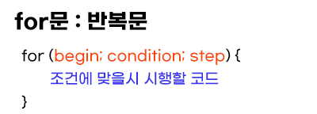
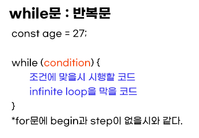
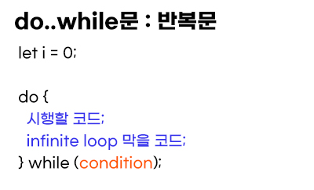

# Loops (반복문) : for and while
- Updates
  - [2020.08.31] - Loop에 대해서 배운걸 정리. for문 while,do..while문, break,continue
  

---
## Loops
- 같은 코드를 반복해서 사용해야 할 때
- 코드는 조건의 값이 truthy일 경우 시행된다.
  
## for statement
  

for문의 특징
- for문의 begin, condition, step 모두 선택사항이다. 그러나 이를 충족할 무언가 있어야 한다.
- begin이 없을 경우 : 전역변수가 필요함
- condition이 없을 경우 : infinite loop 발생 = for body에 condition이 필요함
- step이 없을 경우 : infinite loop 발생 = for body에 condiiton이 필요함


## while statement


## do...while statement


while문과 do..while문의 차이점
- while문은 처음부터 조건을 검사하고 코드를 시행한다.
- do..while문은 제일 처음에는 조건을 검사하지 않고 바로 코드를 시행한다.
- 한번이라도 코드를 시행해야할 때는 do..while문을 사용한다.

## Breaking the loop
- 조건이 안맞을 시에 loop는 종료된다
- 반복문안에 `break`를 사용하면 강제 종료를 할 수 있다.

```javascript
const scores = [10,20,30,40,50];

for(let i=0; i<scores.length; i++) {
  console.log('your score is',scores[i]);
  if(scores[i]===30) {
    console.log('finally! your score is 30');
    break;
  }
}
```
- scores의 length는 5이다. 즉 `i<5`이며 40까지는 시행이 되어야 한다.
- for문 안에 있는 if문에서 `scores[i]===30`일 경우 `break`를 넣었다.
- 즉, 40은 시행되지 않고 30이 시행된 이후에 강제 종료된다.

## Continue to the next iteration
- 반복문 안에 `continue`를 사용하면 중간에 mini break를 넣을 수 있다.
- 조건에 맞는 코드에는 break가 시행되고, 뒤에 loop는 마저 이어 나간다.

```javascript
for (let i = 0; i < 10; i++) {

  // if true, skip the remaining part of the body
  if (i % 2 == 0) continue;

  alert(i); // 1, then 3, 5, 7, 9
}
```
- if문이 true이면 break를 하되 다음 loop를 이어나간다.
- 즉 if문은 변수 i가 2로 나눴을 때 나머지가 0이면 break를 건다. 즉 2의 배수는 전부 break로 alert되지 않고 홀수인 1,3,5,7,9만 continue에 의해 시행된다.