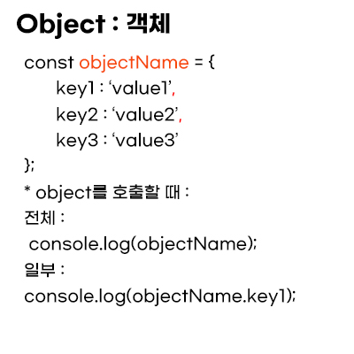

# Object (객체)

- Updates
  - [2020.08.31] - 기초 개념 정리
  - [2020.10.06] - OOP를 배우면서 객체에 대한 개념이 부족하다고 생각하여 따로 공부 & 정리.

---

## Object



- key: value 형태로 이루어져 있다
- value에는 string, number뿐만 아니라 function과 같이 object도 들어갈 수 있다.
- 콤마로 구분한다.

## Accessing Properties : dot notation , and bracket notation

- if the property is not exist on the object, it returns `undefined`

```javascript
console.log(objectName["key1"]);
```

- MUST USE BRACKET NOTATION : accessing keys that contains numbers, spaces, or special characters in them.
- Also, variable can be used in the BRACKET NOTATION inside the brackets to select the keys of an object.

```javascript
const person = {
  name: "Kim",
  age: 10,
  "School Name": "awesome school",
  grade: "A",
};

let propName = "School Name";

console.log(person[propName]); // key를 variable에 넣을 때는 bracket notation을 사용한다.
```

- objectName[propName] - will look for value of the propName
- objectName.propName - will look for a key of the propName

## Property Assignment

```javascript
const person = {
  name: "Kim",
  age: 10,
  "School Name": "awesome school",
  grade: "A",
};

person["name"] = "Lee";
person.name = "Lee";
```

- Objects are mutable meaning we can update them after we create them.
- use dot notation or bracket notation and add the value with assignment operator.
- we can’t reassign an object declared with `const`, we can still mutate it

```javascript
const person = {
  name: "Kim",
  age: 10,
  "School Name": "awesome school",
  grade: "A",
};

person = {name: "Park"}; // error
person.name = "Park"; // mutate the value.
```

## Deleting the property from an object

```javascript
const person = {
  name: "Kim",
  age: 10,
  "School Name": "awesome school",
  grade: "A",
};

delete person.name;
```

- delete a property from an object with the `delete` operator.

## Methods

```javascript
const person = {
  name: ["Bob", "Smith"],
  age: 32,
  gender: "male",
  interests: ["music", "skiing"],
  bio: function () {
    alert(
      this.name[0] +
        " " +
        this.name[1] +
        " is " +
        this.age +
        " years old. He likes " +
        this.interests[0] +
        " and " +
        this.interests[1] +
        "."
    );
  },
  greeting: function () {
    alert("Hi! I'm " + this.name[0] + ".");
  },
};
```

[출저 MDN]

- name, age, gender, interests는 property이며, bio, greeting은 method이다.
- when the data stored on an object is a function we call that a method.
- Property is what an object has
- Method is what an object does.

## Nested Object

- 말 그대로 객체 안에 객체를 넣는 형태이다.

```javascript
let person = {
  name: "Kim",
  "family-member": {
    father: {
      name: "Kim Kim",
      age: 50,
      hobby: [golf, computer, tv],
    },
    mother: {
      name: "Lee",
      age: 50,
      hobby: [music, video, golf],
    },
  },
  degree: "Computer Science",
};
// 아빠의 첫번째 취미를 선택하는 방법

person["family-member"].father.hobby[0]; // golf
```

## Pass by Reference

[shallow copy and deep copy 참조](../More-JavaScript/shallow-copy-and-deep-copy.md)

## Looping Through Objects

- `for...in` : iterate through objects

```javascript
let home = {
  family: {
    father: {
      name: "kim",
      age: 60,
      sayHi() {
        console.log("Hi!");
      },
    },
    mother: {
      name: "Dan",
      age: 60,
      sayHello() {
        console.log("Hello");
      },
    },
    brother: {
      name: "lee",
      age: 30,
    },
    sister: {
      name: "park",
      age: 25,
    },
  },
};

// for...in
for (let familyMember in home.family) {
  console.log(`${familyMember}: ${home.family[familyMember].name}`);
}
/*
familyMember는 변수이며, 여기서 변수는 객체의 key에 해당한다. 즉, name에 접근 
가능한 key는 father, motehr, brother, sister이기 때문에 변수는 그들이 된다.

father: kim
mother: Dan
brother: lee
sister: park
*/
```

## this

```javascript
const person1 = {
  name: "Chris",
  greeting: function () {
    alert("Hi! I'm " + this.name + ".");
  },
};
```

- 여기서 this는 object의 변수를 칭한다. 즉 this.name은 person1.name과 일치한다.
- 하지만 this가 객체 밖에서 선언이 되면 object이 아닌 window를 칭하게 된다.
- 중요 : this 사용시 arrow function을 사용하면 this는 window object를 칭하기 때문에 사용하지 않는다.
