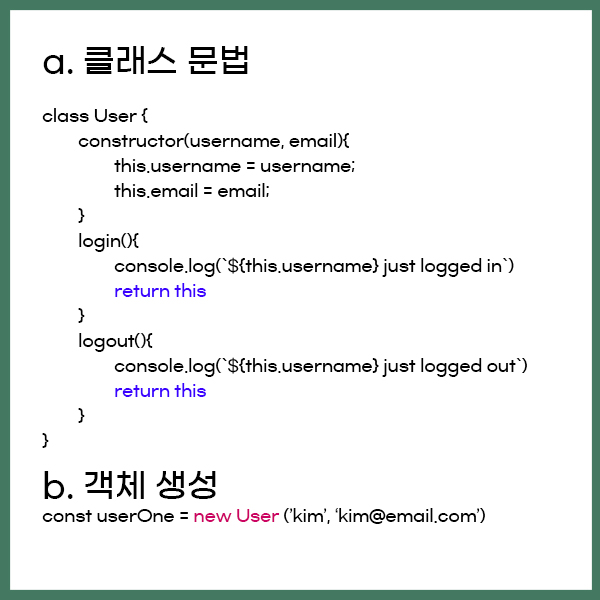
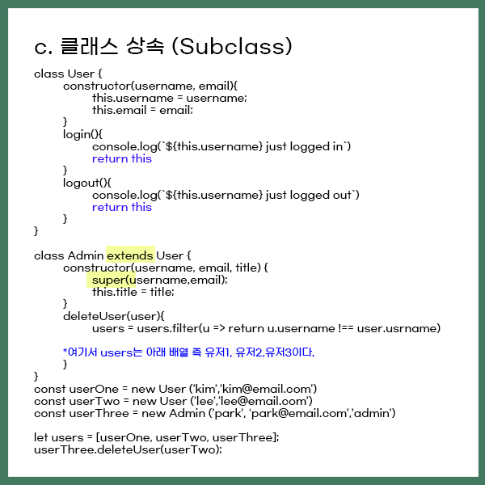

# Code structure

- Updates
  - [2020.10.03] - Classs에 대하여 공부

---
## Class


## What is Class ?  
> Class는 객체를 생성하기 위한 템플릿입니다. 클래스는 데이터와 이를 조작하는 코드를 하나로 추상화합니다. 자바스크립트에서 클래스는 프로토타입을 이용해서 만들어졌지만 ES5의 클래스 의미와는 다른 문법과 의미를 가집니다. <출저 MDN>

## Class declaration (클래스 선언)
```javascript
class User {
  constructor(username,age){
    this.username = username;
    this.age = age;
  }
}
```
## Class expression (클래스 표현) 
```javascript

//unnamed
const User = class {
  constructor(username,age){
    this.username = username;
    this.age = age;
  }
}

//named : User
const User = class User {
  constructor(username,age){
    this.username = username;
    this.age = age;
  }
}
```
`const userOne = new User('kim',20)`


- `extends` 를 통해서 User를 확장하여 Admin 클래스를 만들 수 있다.
- `super()`메소드 사용 시, User클래스 생성자에 접근할 수 있다.

## ES5 with Constructor and Prototype

- ES5에서는 사용자 정의 타입 생성이라는 접근 방식을 가졌다. 
- 생성자를 생성, 생성자의 프로토타입에 메서드 할당.

```javascript
//constructor
function User(username,email){
  this.username = username;
  this.email = email;
}

//method
User.prototype.login = function(){
  console.log(`${this.username} just logged in`)
}

//prototypal inheritance 
function Admin (username,email,title){
  User.call(this,username,email) // User 클래스의 constructor상속
  this.title = title;
}

Admin.prototype = Object.create(User.prototype) // User 클래스의 메소드 상속
```