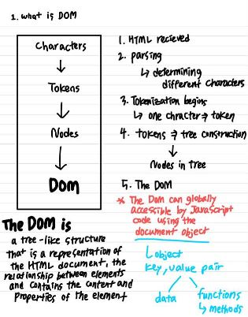
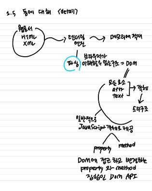
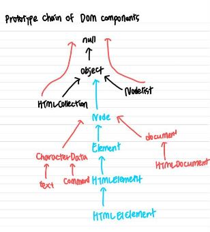
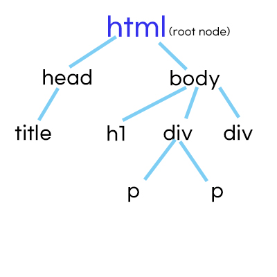
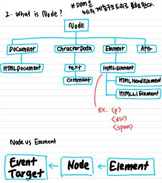
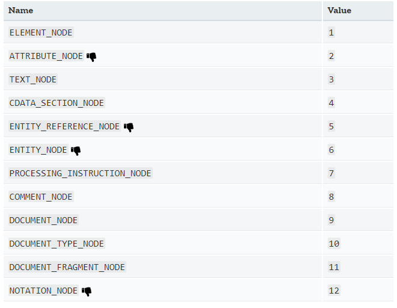

# The DOM

- Updates
  - [2020.08.31] - explanation 정리
  - [2020.09.03] - window object란 무엇인지 간략히 공부 및 정리.
  - [2020.09.07] - 돔에 대한 기초, 돔이 어떻게 구성되는지에 대해 좀 더 자세히 알아보았다.

---

## 1. DOM describes HTML as a hierarchical tree of notes.

The Document Object Model (DOM) is a programming interface for HTML and XML documents. It represents the page so that programs can change the document structure, style, and content. The DOM represents the document as nodes and objects. That way, programming languages can connect to the page. <출저: MDN>

- `<html>`이 가장 위에 있기 때문에 root node
- `<title>` , `<h1>` , `
` , `
` text node

## 2. Node에 대해

- DOM은 트리 형태의 구조를 가지고 있으며, 이러한 계층 구조 트리는 자식이 부모에게 method와 property를 물려 받는다.
- `Node` 의 부모는 `EventTarget` 이기 때문에 `Node` 의 property 와 method 이외에도 `EventTarget`에게서 property와 method를 물려 받을 수 있다.

## Node properties

(1) `Node.baseURI` : returns a DOMString, base URL of the document containing the Node.

(2) `Node.childNodes` : returns a live NodeList(which can automatically updated when there is a change), all the children of this node.

(3) `Node.firstChild` : returns a Node which is the first direct child node of the node, or null if the node has no child

(4) `Node.isConnected` : returns a boolean, indicates whether or not the Node is connected to the context object.

(5) `Node.lastChild` : returns a Node, last direct child node, or null

(6) `Node.nextSibling` : returns a Node, next node in the tree or null

(7) `Node.nodeName` : returns a DOMString containing the name of the Node

(8) `Node.nodeType` : returns a assigned value number

(9) `Node.nodeValue` : Returns / Sets the value of the current node.`

- Document = null / Element = null / Text = 문자열

(10) `Node.owenerDocument` : returns the document that the node belongs to, if node is a document, returns null.

(11) `Node.parentNode` : returns a Node that is the parent of this node, or returns null if this node is the top of the tree or not in a tree.

(12) `Node.parentElement` : returns a Element that is parent of this node, or return null

(13) `Node.previousSibling` : returns a Node which is the previous one in the tree or null if there aren't any.

(14) `Node.textContent` : returns, sets the textual content of an element and all its descendants.

## Node Methods

- `Node.appendChild( 자식노드 )` : 현재 노드에 마지막 자식으로 (자식노드)가 들어간다. 만약에 자식노드가 DOM tree에 존재하는 노드였다면 자리를 옮기는 것이다
- `Node.contains()` : returns a Boolean value, indicates whether or not a node is a descendant of the calling node.
- **`Node.getRootNode()` :** Returns the context object's root which optionally includes the shadow root if it is available.
- **`Node.hasChildNodes()` :** Returns a `Boolean` indicating whether or not the element has any child nodes.
- **`Node.insertBefore()` :** Inserts a `Node` before the reference node as a child of a specified parent node.
- **`Node.removeChild()` :** Removes a child node from the current element, which must be a child of the current node.
- **`Node.replaceChild()` :** Replaces one child `Node` of the current one with the second one given in parameter

## Window Object

- global object(전역객체)이기 때문에 모든 객체를 담고있어서 window를 생략할 수 있다.

  ex. console.log() = window.console.log()인데 window가 생략된 것.

- 자료형 모두 window object안에 들어가 있다.

## method

`setTimeout(function,time)` - 콜백함수를 지정한 시간 뒤에 실행할 수 있도록 하는 메소드.

`setInterval(function,time)` -콜백함수를 지정 시간 마다 실행할 수 있도록 하는 메소드.

`clearInterval(variable)` - 변수의 interval을 끝내는 메소드

`scrollTo(x좌표,y좌표)` - x와 y좌표에 따른 스크롤 이동
