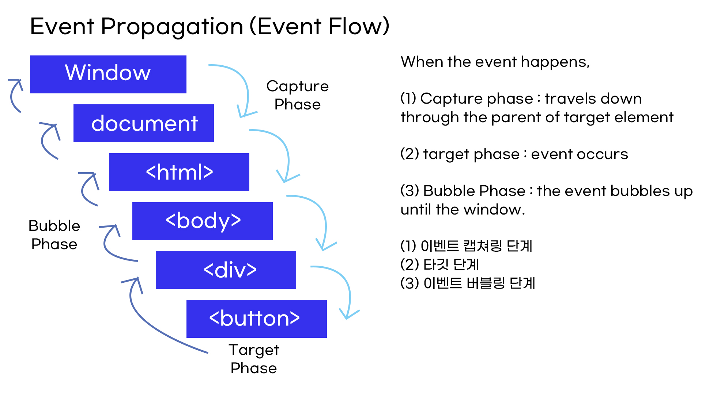

# Event

- Updates
  - [2020.09.01] - addEventListener()라는 메소드 및 event object에 대해 공부 및 정리
  - [2020.09.02] - bubbling and capturing에 대해 공부 및 event flow, delegation추가, 이벤트리스너에 매개변수에 대한 설명 추가

---

## Event Flow


`<button>` 이 타깃이라고 할 때,

(1) Capturing Phase : window ⇒ <div>까지 event listener가 있는지 탐색하고 있을 시 실행

(2) Target Phase : 이벤트 리스너 실행

(3) Bubbling Phase : <div> ⇒ window까지 event listener가 있는지 탐색하고 있을 시 실행

이러한 phase를 구분하는 방법은 `.addEventListener()` method에서 확인할 수 있다.

## `addEventListener()`

**Definition :**

The addEventListener() method allows you to add event listeners on any HTML DOM object such as HTML elements, the HTML document, the window object, or other objects that support events (출저. w3school)

**Basic syntax:**

- `addEventListener()`의 매개변수는 3가지이다 ( event, function, useCapture )
  - **event :** event는 이벤트가 어떤 방식으로 실행되는지에 대한 것 - reference 확인
  - **function :** 여기에 들어가는 콜백함수는 이벤트가 실행될 시에 실행될 코드를 작성
  - **useCapture :** dafault는 false이며 false=bubbling이다. true=capturing. 이벤트 전파방식.

```javascript
element.addEventListener(event, function, useCapture);

//example

const button = document.querySelector('button');

//with function declaration

button.addEventListener("click", function(){//클릭할때 시행할 코드});

//with arrow function

button.addEventListener("click",()=> {//클릭시 이벤트});
```

Event reference 모음

[Event reference](https://developer.mozilla.org/en-US/docs/Web/Events)

## Event Object = Event handler function's parameter

**Definition :**

Sometimes inside an event handler function, you'll see a parameter specified with a name such as `event`, `evt`, or simply `e`. This is called the **event object**, and it is automatically passed to event handlers to provide extra features and information. (출저 : mdn)

- addEventListener() 를 사용하면 두번째 자리에 콜백함수가 들어오게 되는데, 이벤트 핸들러 함수가 매개변수를 갖게 되면 첫번째 매개변수에는 자동으로 객체를 가지고 오는데 그게 바로 event 객체이다.

Event object has many properties to handle event

```javascript
//event object을 통해 .target 사용해보기 : 이벤트가 실행이 된 곳만 타깃하는 것.
const items = document.querySelectorAll("li");

items.forEach((item) => {
  items.addEventListener("click", (e) => {
    e.target.style.color = "red"; //'클릭된' li태그의 글씨 색만 빨간색으로 바뀌기
  });
});
```

## Event Delegation

**How Event Delegation Works :**

the parent delegates event listener to children by using event bubbling.

**Example :**

HTML body

```html
<body>
  <h1>Todos</h1>

  <ul>
    <li>buy milk</li>
    <li>play the guitar</li>
    <li>buy a book</li>
    <li>pay the bill</li>
  </ul>

  <button type="button">Add list</button>
</body>
```

```javascript
// example : event delegation을 안줄 때 문제점
const button = document.querySelector("button");

button.addEventListener("click", () => {
  const li = document.createElement("li");
  li.textContent = "something new to do";
  ul.append(li);
});

const items = document.querySelectorAll("li");

items.forEach((list) => {
  items.addEventListener("click", (e) => {
    e.target.remove();
  });
});
```

**문제점 1 :**

button을 클릭 시, 새로운 `<li>`를 생성한다. 새로 생성된 `<li>`는 클릭 시 지워지는 이벤트 리스너는 실행되지 않는다. 그 이유는 `forEach()` 메소드가 실행된 이후에 생겼기 때문에

**문제점 2 :**

그렇기 때문에 새로 생성된 `<li>`에는`addEventListener()`메소드를 추가로 주어야 되는데 이벤트 리스너가 많으면 성능적으로 좋지 않다

```javascript
// example : event delegation을 줄 때
const ul = document.querySelector("ul");

const button = document.querySelector("button");

button.addEventListener("click", () => {
  const li = document.createElement("li");
  li.textContent = "something new to do";
  ul.append(li);
});

// (1)번 방법

ul.addEventListener("click", (e) => {
  e.target.remove();
});

// (1)번의 발전 방법

ul.addEventListener("click", (e) => {
  if (e.target.TagName === "LI") {
    e.target.remove();
  }
});
```

**(1)번 방법 :**

`e.target` = 클릭한 요소이고, 클릭 시 이벤트 버블링이 일어난다.

클릭한 것의 부모노드는 `<ul>`이기 때문에 `<ul>`의 이벤트인 `remove()`메소드가 실행된다.

이는 새로운 `<li>`가 생성이 되어도 이벤트는 `<ul>`에 등록되어 있기 때문에 모두 적용이 가능하다.

하지만, **문제점**이 하나 있다.

`e.target` = 클릭한 요소이다.

즉, `<li>`태그의 자식노드로 `<span>`이 있다고 가정할 때, `<span>`클릭 시 이벤트 버블링으로 `<ul>`의 `remove()`메소드가 실행되고, `<li>`는 남은 채 `<span>`만 지워지게 된다.

즉, e.target = `<li>`라는 가정이 필요하다. (1)번의 발전 방법을 보자.

## Method and Property

**강의에서 배운 method**

`remove()` - remove

`stopPropagation()` - 해당 이벤트가 전파되는 것을 막는다. (해당 태그만 막기 때문에 비추)

`createElement()` - add new element

`append()` - at the bottom

`prepend()` - at the top

**강의에서 배운 property**

`event.target` - 이벤트 중 선택한 태그

`element.TagName` - read-only property of the Element interface returns the tag name of the element on which it's called in upper-case.
