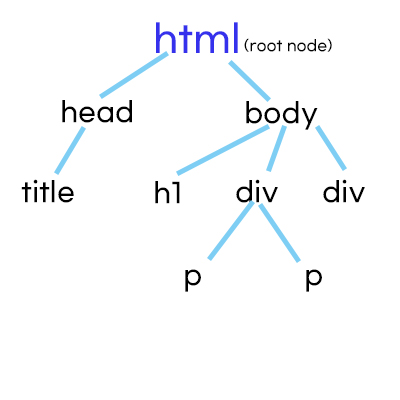

# The DOM

- Updates
  - [2020.08.31] - explanation 정리

---

- created by the browser
- 'document' object
- interact with HTML

## 1. DOM describes HTML as a hierarchical tree of notes.

- `<html>`이 가장 위에 있기 때문에 root node
- `<title>` , `<h1>` , `
` , `
` text node
