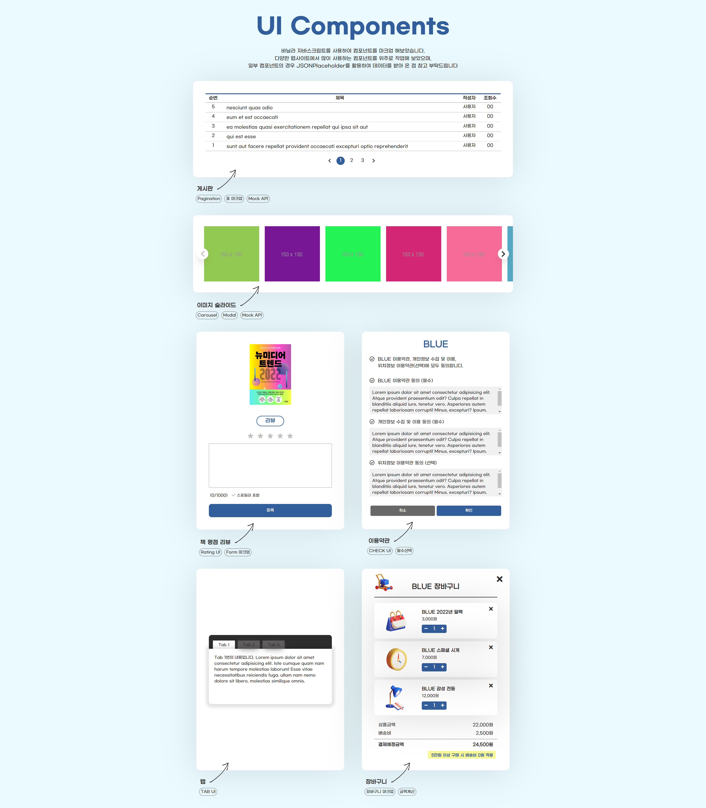

## 개요 📃

> **자바스크립트 마크업 연습**

- 자바스크립트 ES6문법으로 다양한 컴포넌트 마크업 연습

## 사용기술 🤗

- 퍼블리싱

  - HTML
  - CSS
  - JavaScript (ES6)

## 기간 📅

> 약 6일

## 실행화면 🌟



## 배운 점 😌

1. **MOCK API 활용하여 REST.API 공부하기**

- MOCK API를 통해 API 데이터를 받아오고 화면에 마크업하는 방법을 터득하였습니다.

```js
//BOARD - GET DATA
const BOARD_URL = "https://jsonplaceholder.typicode.com/posts";
fetch(BOARD_URL)
  .then((response) => response.json())
  .then((json) => {
    //15개 데이터 사용을 위해 slice 사용
    const board = json.slice(0, 15);

    const numberOfItems = board.length;
    const numberPerPage = 5;
    const totalPages = Math.ceil(numberOfItems / numberPerPage);
    const currentPage = 1;
    renderPagination(totalPages);
    renderBoardLists(board, numberOfItems, numberPerPage, currentPage);
    renderPage(board, numberOfItems, numberPerPage, currentPage);
  });
```

1. **함수를 만들어 코드 재사용**

- 회원가입 이용약관 컴포넌트의 경우 일부 코드가 재사용되어 해당 코드를 함수로 만들어 재사용해보았습니다.

```js
//TOS - CHANGE INPUT(CHECKED) STATE
const changeCheckState = (elem) => {
  if (elem.classList.contains("active")) {
    elem.nextElementSibling.checked = true;
  } else {
    elem.nextElementSibling.checked = false;
  }
};

//TOS - BTN STYLE
const addBtnStyle = (elem) => {
  elem.classList.add("active");
};
const removeBtnStyle = (elem) => {
  elem.classList.remove("active");
};
```

- 장바구니 UI의 경우 금액에서 필요한 `원` 과 `,` 의 경우 계산 시 삭제하여야 하기 때문에 정규함수식을 통해 해당 글자를 삭제 후 다시 입력하는 방법으로 함수를 만들었습니다.
- 정규함수식의 경우 인터넷을 검색하여 활용하였습니다.

```js
const chnageIntoNum = (price) => {
  return Number(price.slice(0, -1).replace(/\,/g, ""));
};

const addComma = (num) => {
  const str = num.toString().split(".");
  str[0] = str[0].replace(/\B(?=(\d{3})+(?!\d))/g, ",");
  return str.join(".");
};

const editPrice = (targetElem, index) => {
  const priceIndex = targetElem.closest(".product").dataset.index;
  const price = priceData[priceIndex]; //기존가격

  //계산을 위한 정규표현식 - '원', 콤마 삭제 -> 계산 후 '원', 콤마 추가 후 삽입
  const priceNum = chnageIntoNum(price);
  const newPriceNum = addComma(priceNum * quantityData[index]);
  targetElem.parentElement.previousElementSibling.textContent = `${newPriceNum}원`;
};
```
