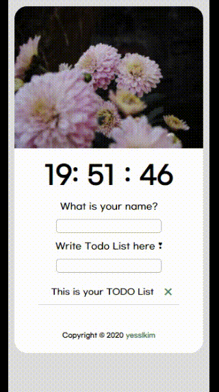

# Clone Momentum Project

✔️ 소개  
Clone Momentum
노마드코더의 바닐라 JS로 크롬 앱 만들기를 수강하며 만든 프로젝트입니다.  
제작기간 : 20.09.30 - 20.10.02 [총 3일, 매일 약 4-5시간]

✔️ 개발환경

- 개발도구 : VSCode, Github
- 구성환경 : HTML, CSS, VanilaJS

✔️ 핵심기능

- 시계
- Weather API를 통한 날씨 정보 공유
- 배경 랜덤 사진
- 로컬 스토리지를 통한 사용자 이름 및 할일 목록 저장
- 할일 추가, 삭제 기능

✔️ 공부내용

- 공부한 내용에 대해 적어보며 정리하는 시간을 가졌습니다.
- [시계wiki](./What-I-Learned/1.in-clock-js.md)
- [사용자 이름 관련 wiki](./What-I-Learned/2.in-greetings.md)
- [할일 목록 wiki](./What-I-Learned/3.in-todo-list.md)
- [날씨 관련 wiki](What-I-Learned/4.in-weather.md)

✔️ 완성본

