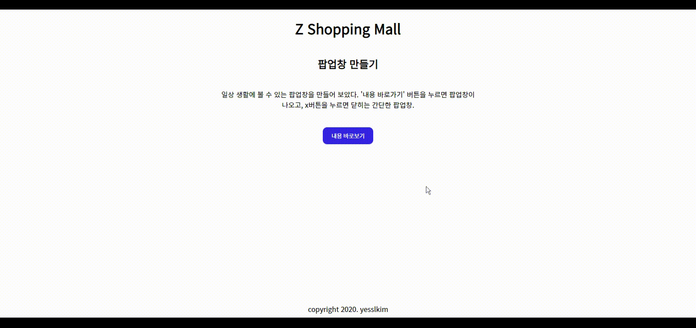

# Today I Learned (TIL)

👩‍💻 Today I learned. 그날 배운 것을 기록합니다 ✨

- TIL이지만 개념별로 기록하며 날짜는 문서 내에만 기록합니다.  
  이미 배운 내용을 추가 공부 시 개념별로 기록하기 위함입니다.

---

## 작성규칙

- 폴더와 파일명은 영어로 한다.
- 확장자는 `.md`로 하여 마크다운으로 작성한다.
- 개념을 기준으로 분류하여 기록한다.  
  단, 날짜는 문서내에 기록하여 언제 공부하였는지 명시한다.

## HTML & CSS

HTML 및 CSS는 **네이버 블로그**를 통해 기록했습니다.  
 다시 옮기는 것은 무의미하다고 판단하여 사이트를 첨부합니다.😊  
 [사이트 바로가기](https://blog.naver.com/yesslkim94)

## JavaScript

> 해당 글은 JavaScript Udemy 강좌를 보며 공부한 내용을 정리했습니다  
> 부족한 부분은 MDN 및 ko.javascript.info를 통해 공부하고 있습니다.😊

- Basics
  - [Code structure](Javascript/Basics/1.Code-structure.md)
  - [Variables and Constants](Javascript/Basics/2.Variables-and-Constants.md)
  - [Operators](Javascript/Basics/3.Operators.md)
  - [Data Types](Javascript/Basics/4.Data-Types.md)
  - [Number wrapper object](Javascript/Basics/4a.Number-wrapper-object.md)
  - [Math object](Javascript/Basics/10a.Math-Objects.md)
  - [String wrapper object](Javascript/Basics/4a.String-wrapper-object.md)
  - [Function](Javascript/Basics/5.Function.md)
  - [Function-callback function](Javascript/Basics/5a.Callback-Function.md)
  - [Array](Javascript/Basics/6.Array.md)
  - [Array - forEach() method](Javascript/Basics/6a.ForEach-Method.md)
  - [Condition - if, switch](Javascript/Basics/7.Condition-if-switch.md)
  - [Loops - for, while](Javascript/Basics/8.Loops-for-while.md)
  - [Object](Javascript/Basics/10.Object.md)
  - [Call stact and memory heap](Javascript/Basics/9.Call-stack-and-Memory-heap.md)
- The DOM
  - [What is DOM](Javascript/the-DOM/1.The-DOM-Explanation.md)
  - [Properties 모음](Javascript/the-DOM/2.Properties.md)
  - [Methods 모음](Javascript/the-DOM/3.Method.md)
  - [Event에 대하여](Javascript/the-DOM/4.Event.md)

## Small Practices

> 학습한 자료에서 제공되는 문제를 직접 풀면서 기본 개념을 습득하고 있습니다.
> 학습한 자료를 기반으로 만들어보는 실습 예제를 모아 보았습니다.

- CSS
- JavaScript
  - [2020.08.15] Practice about Variables, Operators, and Data Types
    - HTML, CSS 제공됨 / JS문제풀이
  - [2020.08.18] Daily Practice
    - 간단히 빈칸에 정답하는 방식. 기본 개념을 확인하기 위한 문제풀이
  - [2020.08.19] Practice about Functions
    - HTML, CSS 제공됨 / JS문제풀이
  - [2020.08.20] Daily Practice
    - 기본 개념을 확인하기 위한 문제풀이 - variable편
  - [2020.08.21] Daily Practice
    - 기본 개념을 확인하기 위한 문제풀이 - math편 (operators, datatype, assignment shorthand etc )
  - [2020.08.22] Daily Practice
    - 기본 개념을 확인하기 위한 문제풀이 - String 복습
  - [2020.08.23] Daily Practice
    - 기본 개념을 확인하기 위한 문제풀이 - Array 복습
  - [2020.08.23] Daily Practice
    - 논리연산자 기초 학습용 연습문제 - 논리연산자 복습
  - [2020.09.02] 간단한 팝업창 구현해 보기 - The DOM Event - 열기, 닫기 버튼 (using event listener)
    
    [관련된 readme 바로가기](small-practices/JavaScript/3.Making-a-pop-up/readme.md)
