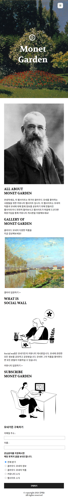

## 개요 📃
GSAP과 GSAP 플러그인 ScrollTrigger를 학습하고 만든 웹사이트
웹사이트: monet-garden.netlify.app

## 사용기술 🤗
### 퍼블리싱
HTML
CSS
JavaScript

### 플러그인
GSAP
GSAP ScrollTrigger

## 기간 📅
2021.12.03 - 2021.12.04

## 구현한 기능 🔧
스크롤 시 GSAP을 활용한 다양한 Effect 구현

## 웹사이트
### DESKTOP

### TABLET

### MOBILE

## 느낀점
개인적으로 아직까지 GSAP은 조금 어려운 편이다. 다만 이번에 활용해서 웹사이트를 만들면서 어떻게 사용하는지 감을 잡을 수 있었던거 같다. 그리고 간단한 웹사이트의 레이아웃은 어떻게 잡아야 효율적인지 이번에 하면서 더 알게 된 느낌이었다 😋