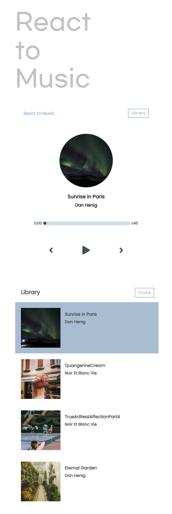

## 기획의도
이전에 국비학원에서 엘피 페스티벌 웹사이트를 만든 경험이 있다. 그때 처음으로 Audio API를
사용해보았는데, 자세히 사용해 보지는 못해서 이번에 다시 사용해 보고 싶었고,
리액트를 공부하면서 심플한 웹사이트를 만들어보고 싶었다.

## Front-end Skills
- React
- SCSS
- Deploy in Netlify

## 느낀점
우선 컴포넌트를 설계하는 방법을 터득했다고는 생각지는 않는다. 다만, 리액트의 Hooks와 기본적인 활용도를 공부할 수 있었던거 같다. 아쉬운 점이 있다면, 컴포넌트끼리 공유하는 state가 
굉장히 많아서 공통 조상으로 state를 올리는 경우가 많다보니 중간에 고치기 까다로웠다. 리액트는 하향식 데이터 흐름을 따르는 것을 추천했기 때문에 좀 더 활용도 높게 코드를 구성하는 방법을 공부해야겠다고 생각했다.