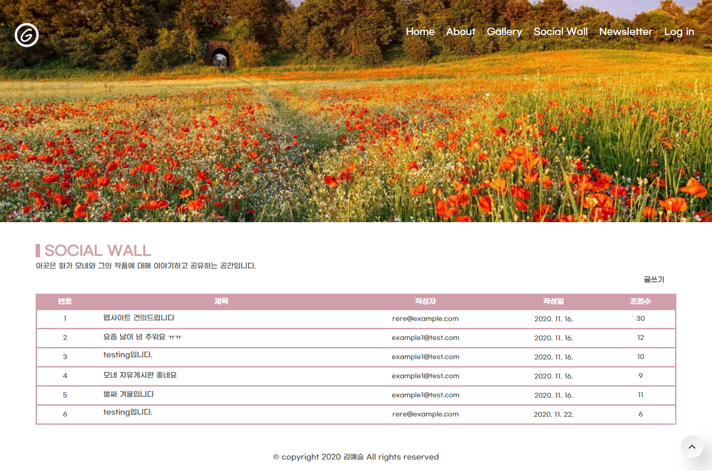
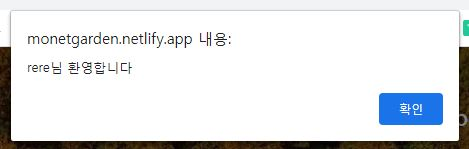
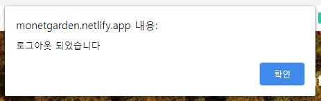

# Monet-Garden
제가 좋아하는 화가인 모네의 웹사이트를 만들어 보았습니다

## 구현한 기능
- 로그인
  - 로그인창
  
  - 아이디, 비번 틀렸을 시,
  
- 게시판 글쓰기 (로그인 유저만 해당)
  - 비로그인 시,
  
  - 로그인 시,
  
- 게시글 삭제
  - 본인 게시글이 아닐 경우,
  
  - 본인 게시글일 경우
  
- 조회수 증가

## 추가 업데이트
- 2020.11.26 : 페이지 디자인 변경, 상태에 따른 알림바 추가
- 커뮤니티 페이지 디자인 변경
  
  
- 로그인, 로그아웃시 상태 알림바 추가
  - 로그인 시  
  
  - 로그아웃 시  
  