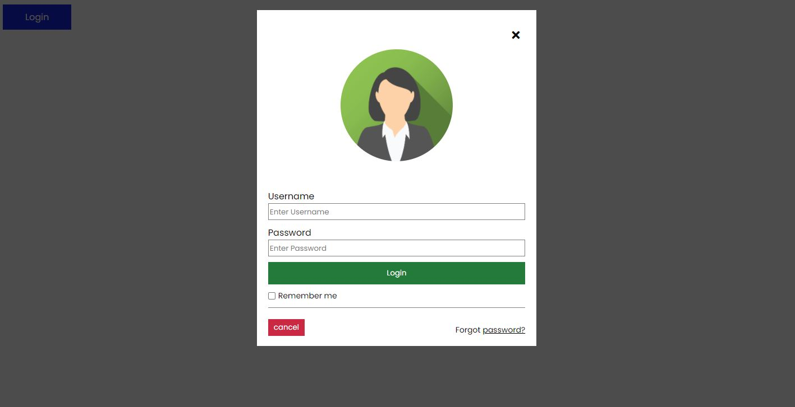

# Learn JS in Real Example

다양한 예제들을 통해 자바스크립트를 배워보도록 합니다.

### 작성규칙

- 각 폴더에 있는 README.md를 통해 예제를 통해 공부한 내용을 따로 기록한다(회고).
- 예제코드를 보지 않고, 오직 내가 공부한 것을 토대로 코드를 작성해 본다.
- 끝으로 예제코드를 보고, 효율적인 코드 방식을 모색합니다.

### Table of Contents

- 이미지 슬라이드 [README.md 바로가기](./[200914]-image-slides/README.md)
  
- 로그인 폼 [README.md 바로가기](./[200920]-Login-form/README.md)
  
