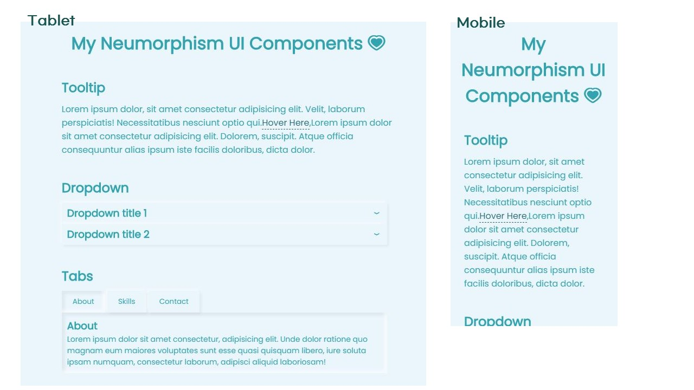

# My Neumorphism UI Componenents

재사용 할 수 있는 UI 컴포넌트 모음 🎒

## 프로젝트 소개

웹사이트를 클론 코딩하면서 느꼈던 것은 재사용 할 수 있는 컴포넌트가 꽤 많다는 것입니다. 하지만, 재사용을 하기 위해 매번 기억이 나지 않는 폴더를 검색해가면서 해당 컴포넌트를 찾는 것은 시간낭비라고 생각했습니다.

그래서, 대표적으로 많이 쓰는 컴포넌트 라이브러리를 만들어보았으며, 제가 좋아하는 뉴모피즘 디자인을 넣어 모던하면서도 재사용하기 좋은 심플한 디자인으로 만들어보았습니다.

해당 [웹사이트](https://neumorphismlibrary.netlify.app/)에서 실제로 확인할 수 있습니다 :)

## 사용해 본 기술 및 프로그램 🌠
- HTML
- CSS
- Vanilla JavaScript
- Webpack (with Babel)
- Netlify (Web Hosting)

## 배운점
- CSS  
이번에 뉴모피즘 디자인을 어떻게 제대로 표현할 지에 대해 고민하면서 box-shadow와 text-shadow에 대해 공부할 수 있는 좋은 시간이 되었다. 비록 텍스트 같은 경우 가독성이 좋지 않아서 추가하지 않았지만, 200px이상의 폰트가 필요로 하는 곳에서는 충분히 잘 사용할 수 있을 것이라 생각했다. 

- JavaScript  
다른 프로젝트보다도 특히 이번 프로젝트에서 많은 것을 배워 나갈 수 있었다. 
- Module에 대해서 실습을 진행해본 점. 사실 개념적으로는 무슨 뜻인지 이해했지만, 이걸 실제로 어떻게 사용할 지 의문이었다. 그리고 항상 컴포넌트별로 관리하는 것이 좋다는 의미도 정확히 인지하지 못했다. 하지만 이번 실습을 통해 컴포넌트 별로 관리하는 것이 유지보수에 얼마나 좋은 지 조금이나마 알 수 있었고 모듈을 직접 사용해 본것이 많은 공부가 되었다.
- 다양한 ES6 문법을 활용하여 구현해본 점. 
- 지금까지 무언가를 만들 때 항상 어떤걸 만들면 좋을지에 대해서는 많은 생각을 해보았지만, 어떻게 만들면 좋을 지에 대한 생각은 항상 부족했던거 같다. 현재 웹사이트에서 사용되는 다양한 컴포넌트를 만들면서 사용자의 입장에서는 어떤 것이 사용자 친화적인지에 대해 조금이나마 고민해 볼 수 있는 시간을 가지게 되었다.

- Webpack and Netlify
1. 처음으로 웹팩을 직접 빌드해보는 시간을 가졌다. documentation을 따라서 무작정 따라하다보니 처음에 필요없는 라이브러리를 다운 받게 되는 경우가 많아서 그 이후로 지우는 데 시간이 더 오래걸렸다. 아직까지는 익숙치는 않지만, package.json과 webpack.config.js를 보며 이해할 수 있을 정도로 공부가 되어 많은 도움이 되었다.

## 구현컴포넌트
- [x] Tooltip
- [x] Tabs
- [x] Dropdown
- [x] Information Bar

## 구현할 컴포넌트
- [ ] Navigation Bar
- [ ] Pagination
- [ ] Thumnail
- [ ] Calendar
- [ ] Profile / Hamburger menu

## 추가로 해야할 사항
- [x] media query for mobile
