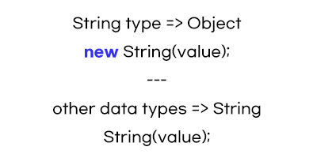

# String Wrapper Object

- Updates
  - [2020.08.30] - String Method 데이터 타입에서 분리 후 정리

---



### 1. Constructor
### 2. String Property

- .length - finding the length of a string

  ```javascript
  let name = "Kim";
  name.length;
  ```

### 3. String Method

- .toString() - convert from number to string

  ```javascript
  let num = 252;
  let result = num.toString(); // '252' 출력
  ```
- [n] - retrieving a specific string character (n번째 글자 찾기)

  ```javascript
  let name = "Kim";
  name[1];
  ```

- .replace() - 일부단어 추출해서 다른 단어로 교체하기

  ```javascript
  let browserType = "mozilla";
  browserType.replace("moz", "van");
  browserType; // 'vanilla'
  ```
  "moz"는 string 내에서 바꿔야할 값이며 "van"은 교체할 string

- indexOf() - 몇글자에 위치되었는지
 
  ```javascript
  let browserType = "mozilla";
  browserType.indexOf("zilla"); 
  brwoserType.indexOf("vanilla"); 
  ```
  .indexOf("zilla"); // 2. 💡 z가 2번째 글자이기 때문  
  .indexOf("vanilla"); // -1. 💡 포함되지 않은 글자는 -1로 출력

- slice() - 글자 내에서 일부 추출하기

  ```javascript
  let browserType = "mozilla";
  browserType.slice(0, 3); //moz
  ```
  0 = 시작점. 여기서는 'm'  
  3 = 시작점에서 부터의 총 글자 길이. 여기서는 'm'부터 시작해서 3글자이기 때문에 'moz'

- .toLowerCase() - 소문자로 변환

- .toUpperCase() - 대문자로 변환

