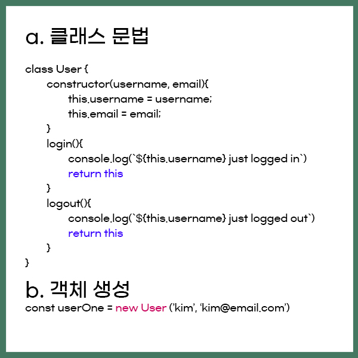
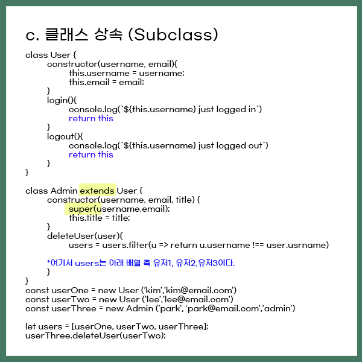

# Code structure

- Updates
  - [2020.10.03] - Classs에 대하여 공부

---
## Class


## What is Class ?  
> Class는 객체를 생성하기 위한 템플릿입니다. 클래스는 데이터와 이를 조작하는 코드를 하나로 추상화합니다. 자바스크립트에서 클래스는 프로토타입을 이용해서 만들어졌지만 ES5의 클래스 의미와는 다른 문법과 의미를 가집니다. <출저 MDN>

## Class declaration (클래스 선언)
```javascript
class User {
  constructor(username,age){
    this.username = username;
    this.age = age;
  }
}
```
## Class expression (클래스 표현) 
```javascript

//unnamed
const User = class {
  constructor(username,age){
    this.username = username;
    this.age = age;
  }
}

//named : User
const User = class User {
  constructor(username,age){
    this.username = username;
    this.age = age;
  }
}
```
`const userOne = new User('kim',20)`


- `extends` 를 통해서 User를 확장하여 Admin 클래스를 만들 수 있다.
- `super()`메소드 사용 시, User클래스 생성자에 접근할 수 있다.

## Getter and Setter (접근자 프로퍼티)
```javascript
class Teacher extends Person {
  constructor(first, last, age, gender, interests, subject, grade) {
    super(first, last, age, gender, interests);
    // subject and grade are specific to Teacher
    this._subject = subject;
    this.grade = grade;
  }

  get subject() {
    return this._subject;
  }

  set subject(newSubject) {
    this._subject = newSubject;
  }
}
```
- Getters and setters work in pairs. A getter returns the current value of the variable and its corresponding setter changes the value of the variable to the one it defines.
- 여기서 underscore(_)로 쓰여진 이름에 바로 접근 가능, 그러나 직접사용하는 것은 좋지 않음. 이 프로퍼티는 객체 내부에서만 활용하고 외부에서는 건드리지 않는 것이 관습.