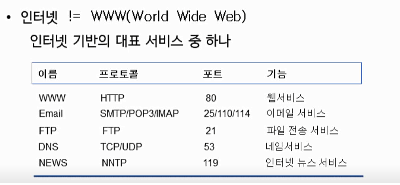
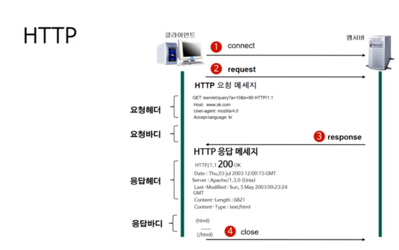

# 웹의 동작

- Updates
  - [2020.09.04] - 웹이 간단히 어떻게 동작하는지, 인터넷은 무엇인지 등을 배웠다.

---

- HTTP 프로토콜의 이해

### 인터넷(네트워크 통신)의 이해

- WWW는 인터넷이 아니다. 인터넷 기반의 대표 서비스 중 하나이다.
- 인터넷은 네트워크들의 네트워크이다.
- TCP/IP 기반의 네트워크가 전세계적으로 확대되어 하나로 연결된 네트워크들의 네트워크.

### HTTP

- 웹에서는 서로 통신하기 위해 HTTP를 사용. 서버와 클라이언트가 인터넷상에서 데이터를 주고 받기 위한 프로토콜이다.
- HTTP/2 까지 버전이 등장한 상태

### HTTP의 작동방식

- HTTP는 서버/클라이언트 모델을 따른다.
- 클라이언트는 서버에게 '요청'하면 서버는 클라이언트에게 '응답'한다.
- 무상태 프로토콜이다.

장점:

- 불특정 다수를 대상으로 하는 서비스에는 적합하다. 클라이언트와 서버가 계속 연결된 형태가 아니기 때문에 클라이언트와 서버간의 최대 연결수보다 훨씬 많은 요청과 응답을 처리할 수 있다.

단점:

- 연결을 끊기 때문에, 클라이언의 이전상황을 알 수가 없다. 이러한 특징을 무상태라고 말한다. 이러한 특징 때문에 정보를 유지하기 위해서 Cookie와 같은 기술이 등장하게 되었다.

### URL(Uniform Resource Locator)

- 인터넷 상의 자원의 위치
- 특정 웹 서버의 특정파일에 접근하기 위한 경로 혹은 주소

> http://www.thisisexample.com/docs/index.html

http = 접근 프로토콜

[www.thisisexample.com](http://www.thisisexample.com) = IP주소 또는 도메인 이름

docs = 문서의 경로

index.htm = 문서이름

**HTTP (Hypertext Transfer Protocol)**

- 요청 메서드 : GET, PUT, POST, PUSH, OPTIONS 등의 요청 방식이 온다.
- 요청 URI : 요청하는 자원의 위치를 명시한다.
- HTTP 프로토콜 버전 : 웹 브라우저가 사용하는 프로토콜 버전이다.

첫번째 줄의 요청메소드는 서버에게 요청의 종류를 알려주기 위해서 사용됩니다.

각각의 메소드 이름은 다음과 같은 의미를 가집니다.

참고로 최초의 웹 서버는 GET방식만 지원해줬습니다.

- GET : 정보를 요청하기 위해서 사용한다. (SELECT)

  - 요청 바디가 없다. URI에 붙어서 감.

- POST : 정보를 밀어넣기 위해서 사용한다. (INSERT)
- PUT : 정보를 업데이트하기 위해서 사용한다. (UPDATE)
- DELETE : 정보를 삭제하기 위해서 사용한다. (DELETE)
- HEAD : (HTTP)헤더 정보만 요청한다. 해당 자원이 존재하는지 혹은 서버에 문제가 없는지를 확인하기 위해서 사용한다.
- OPTIONS : 웹서버가 지원하는 메서드의 종류를 요청한다.
- TRACE : 클라이언트의 요청을 그대로 반환한다. 예컨데 echo 서비스로 서버 상태를 확인하기 위한 목적으로 주로 사용한다.

HTTPS = HTTP + Secure

- 보안용 프로토콜인 SSL 혹은 TLS인증서로 HTTP보안을 강화한 것이 HTTPS. 세션 데이터를 암호화한다.
- SEO에도 유리
