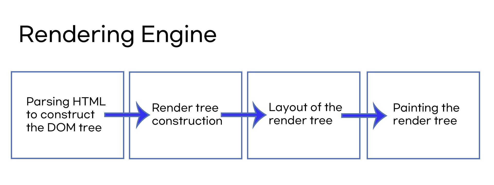
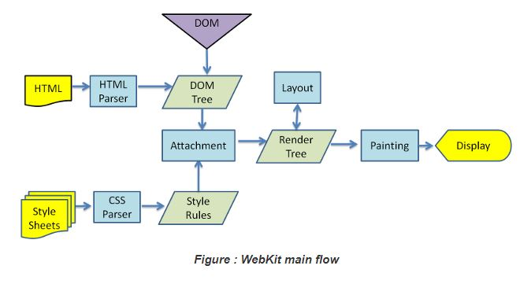
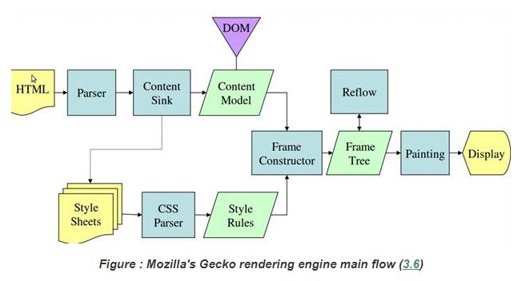
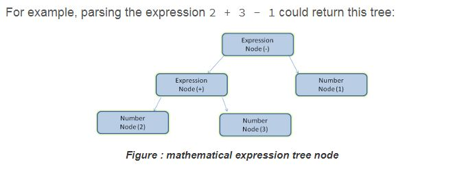
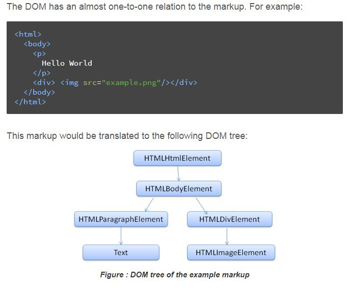
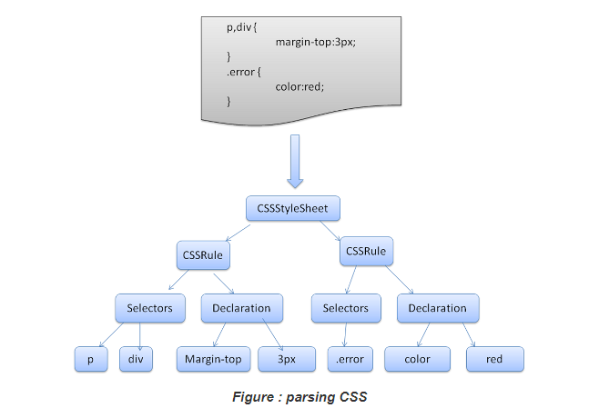

# 브라우저 동작

- Updates
  - [2020.09.04] - 브라우저가 어떻게 동작하는지, 돔 트리는 무엇이고 렌더 트리는 무엇인지 등.

---

브라우저의 주요기능은 사용자가 선택한 자원을 서버에 요청하고 브라우저에 표시하는 것. 보통 HTML문서이지만, PDF, 이미지 또는 다른 형태일 수 있다. 자원의 주소는 URI에 의해 결정된다.

브라우저의 구성 : 브라우저 컴포넌트로 구성되어 있다.

- User Interface : 주소표시줄, 이전버튼과 다음버튼, 북마크. 새로고침 등 요청한 페이지를 보여주는 창을 제외한 나머지 모든 부분.
- Browser Engine : User interface와 rendering engine 사이의 동작을 제어
- Rendering Engine : 요청된 컨텐츠를 보여주는 것.

  - **example. requested content = HTML**  
     rendering engine parses HTML and CSS and displays the parsed content on the screen

- Networking(통신) : for network calls such as HTTP requests
- UI backend :
- JavaScript interpreter: Used to parse and execute JavaScript code.
- Data storage : 자료를 저장하는 계층. the browser may need to save all sorts of data locally, such as cookies. browsers also support storage mechanisms such as localStorage, indexedDB, WebSQL and FileSystem.

### 렌더링 엔진

렌더링 엔진 모음

- Firefox = Gecko
- Safari = Webkit
- Chrome and Opera = Blink

**동작 과정(The main flow)**

1. HTML을 파싱하고 콘텐츠 트리 내부에서 태그를 DOM 노트로 변환. 그 다음 외부 CSS파일과 함께 포함된 스타일 요소도 파싱한다.

파싱한다는 뜻은 문자 단위로 하나하나 해석을 해서 이 내용이 가진 의미들을 파악한다.

1. 렌더 트리를 만든다
2. 렌더 트리를 배치한다 - 각 노드가 화면의 정확한 위치에 표시되는 것을 말한다.
3. 화면에 렌더 트리를 그린다.

**Webkit main flow**

1. HTML 파싱 후 , 돔 트리를 형성한 후에 CSS를 파싱한다.
2. 합쳐진 HTML과 CSS를 key와 value로 된 구조로 만든다 ⇒렌더 트리를 형성
3. 페인팅 ⇒ 화면에 표시 한다는 뜻.

**Gecko main flow**

1. gecko는 배치를 reflow라고 부른다

### 파싱

- 문서를 파싱한다는 뜻은 브라우저가 코드를 이해하고 사용할 수 있는 구조로 변환한다는 의미이다.
- translating document to a structure the code can use. the result of parsing is usually a tree of nodes that represent the structure of the document. this is called a parse tree or a syntax tree.
- 컴파일러 부분에 해당됨.

### HTML parsing

- HTML이 파싱이 된다면 DOM트리를 형성 한다.

### CSS parsing

- CSSRule object 형성, selectors 와 decalration으로 나눠 객체화된 단계를 거친다.
