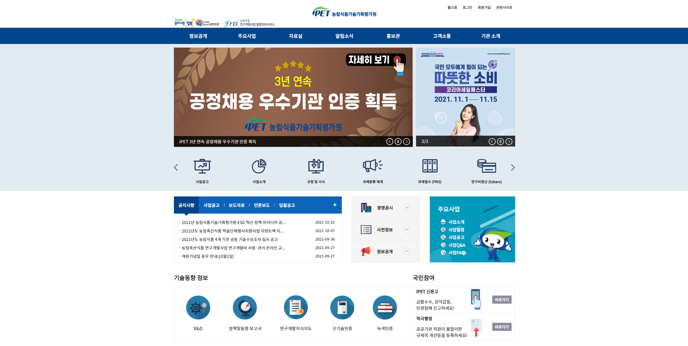
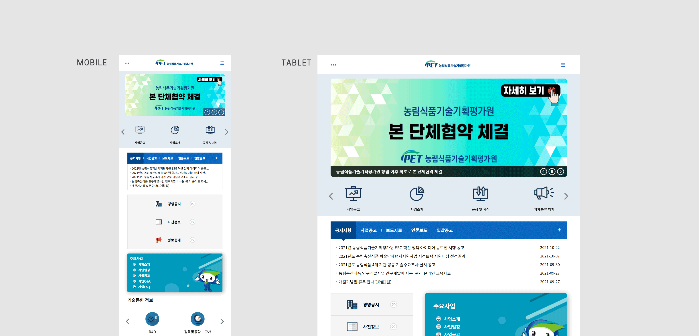

## 개요 📃

> **반응형 웹/ 웹 접근성 / 크로스브라우징**

1.  웹사이트 클론코딩 & 리뉴얼을 통한 반응형 웹 적용
2.  웹접근성에 대해 공부하기 위해 제작
3.  키보드로 접근 가능한 웹사이트를 만들어 보기 위해 제작

## 사용기술 🤗

- 퍼블리싱

  - HTML
  - CSS
  - JQuery

- 플러그인
  - Slick.js

## 기간 📅

> 약 9일

## 실행화면 🌟

## 배운 점 😌

1. **Caniuse, modernizr를 활용하여 크로스 브라우징** 
- 기본적인 CSS 속성을 확인할 때 해당 웹사이트 및 플러그인을 활용하였으며, 각각의 브라우저에 들어가 직접 확인해 보았습니다.
2. **기존 웹사이트 클론코딩 후 리뉴얼 (반응형 적용)**
- 기존 웹사이트는 모바일, 타블릿버전은 따로 없어서 해당 해상도 역시 적용될 수 있도록 media query를 통해 반응형 웹을 적용하였습니다.
3. **NULI 웹사이트, WAVE(크롬 확장프로그램) 웹 접근성 확인**
- 해당 웹사이트를 통해 웹접근성에 필요한 사항에 대해 고민해보았고, 각각의 파트별로 제대로 마크업이 되었는지, 무엇이 부족한지에 대해 확인해 보았습니다.
- 관련된 내용은 [이곳](https://velog.io/@yesslkim94/211115-211114-%EC%9B%B9%EC%A0%91%EA%B7%BC%EC%84%B1-%ED%94%84%EB%A1%9C%EC%A0%9D%ED%8A%B8-4-%ED%81%AC%EB%A1%9C%EC%8A%A4%EB%B8%8C%EB%9D%BC%EC%9A%B0%EC%A7%95-%EC%9B%B9%EC%A0%91%EA%B7%BC%EC%84%B1)에서 확인 가능합니다
4. **일부 컴포넌트 중 키보드로 인식되지 않는 경우 JQuery 활용**
- focus, focusout에 대해 공부할 수 있었습니다.